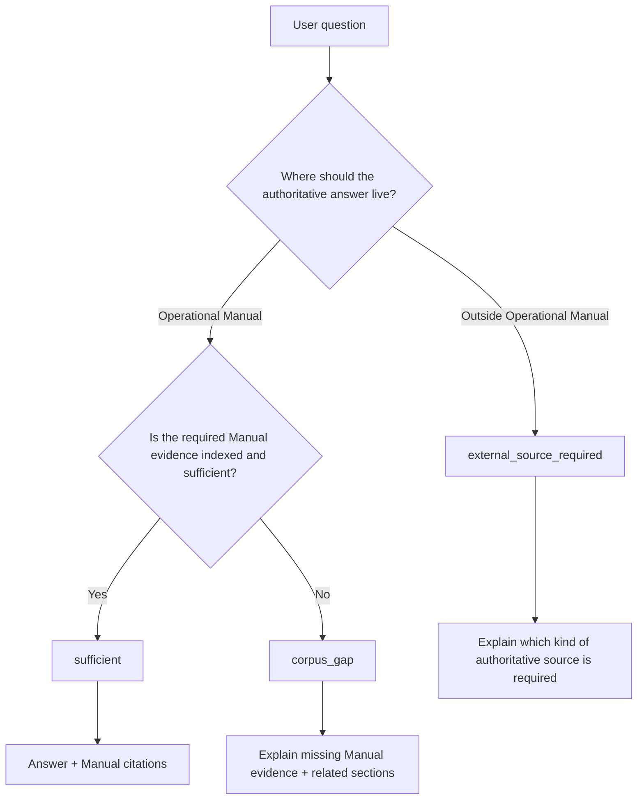
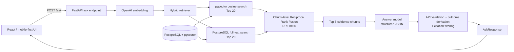
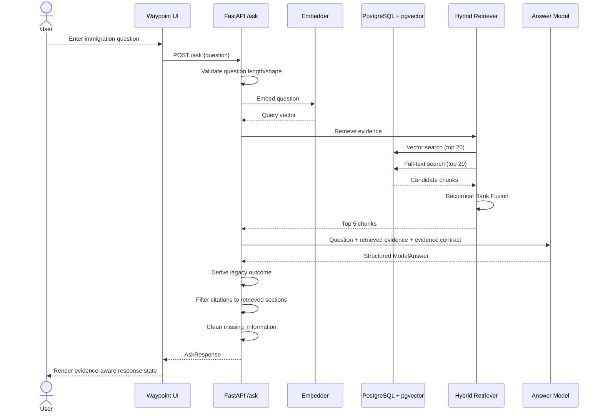
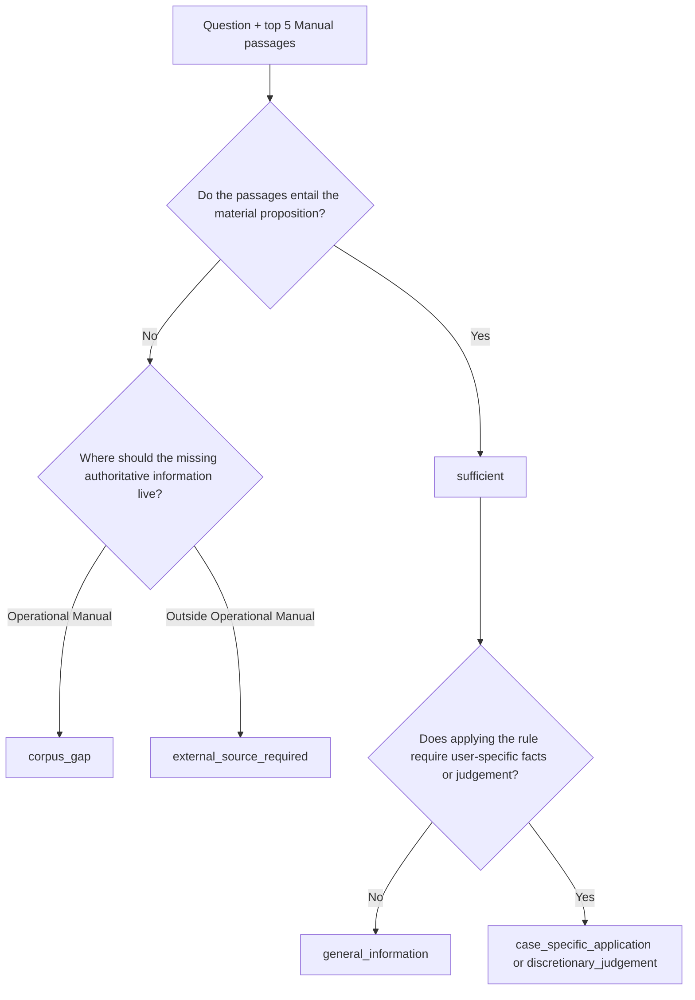
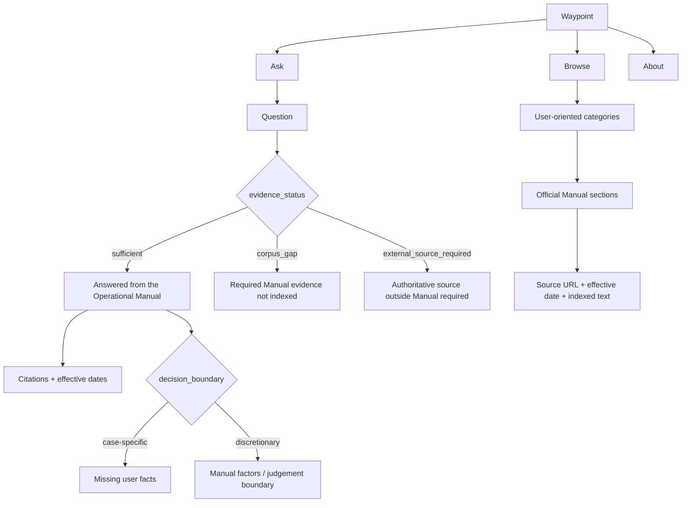
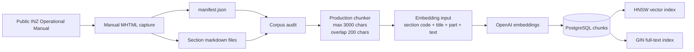
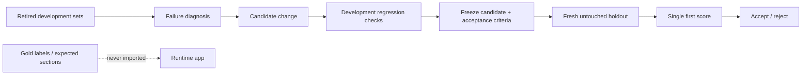

# Waypoint Architecture and End-to-End Question Flow

**Status:** Architecture baseline for the current Waypoint prototype  
**Scope:** Runtime question flow, evidence-status logic, source-of-truth boundaries, UI contract, corpus ingestion, and evaluation controls

---

## 1. Purpose

Waypoint is a bounded retrieval-augmented generation (RAG) system for the publicly published **Immigration New Zealand (INZ) Operational Manual**. Its core product promise is not simply to retrieve related immigration text. It is to determine whether the indexed Operational Manual contains enough evidence to support an answer and to communicate that evidence boundary to the user.

The key design principle is:

> **Answer when the indexed Operational Manual provides sufficient support. Identify a corpus gap when the needed Operational Manual instruction is missing. Identify an external authoritative source when the answer belongs outside the Operational Manual.**

Waypoint does **not** automatically fall back to general web search when the Manual cannot answer a question.

---

## 2. Source-of-truth model

### 2.1 Waypoint v1 evidence boundary

For the current product, the **indexed INZ Operational Manual is the primary runtime evidence base**.

This does not mean that every authoritative New Zealand immigration fact exists in the Operational Manual. Some information is maintained elsewhere, including live service information, fees, country-specific issuing procedures, external-agency assessment products, medical-assessor guidance, or another organisation's eligibility definitions.

Waypoint therefore distinguishes three evidence outcomes:

| Evidence status | Meaning | Product behaviour |
|---|---|---|
| `sufficient` | The retrieved Operational Manual evidence supports the proposition needed to answer the question. | Answer and cite the relevant section(s). |
| `corpus_gap` | The required rule belongs in the Operational Manual, but the indexed corpus/evidence does not contain enough of that rule. | Do not infer. Explain that required Manual evidence is missing and show related sections when useful. |
| `external_source_required` | The authoritative answer is maintained outside the Operational Manual. | Do not pretend the Manual contains it. Identify that another authoritative source is required. |

### 2.2 Authority boundary



### 2.3 What Waypoint v1 deliberately does not do

- It does not treat an LIA, forum post, Reddit answer, Facebook comment, or search result as authoritative evidence.
- It does not automatically browse the open web after an evidence gap.
- It does not use evaluation gold labels, benchmark answers, or expected section codes at runtime.
- It does not turn missing policy into a personalised immigration recommendation.

A future **Official Sources** layer could be added, but it should use an explicit allowlist of authoritative sources rather than unrestricted search.

---

## 3. System architecture

### 3.1 Runtime architecture



### 3.2 Current core components

| Layer | Current design |
|---|---|
| UI | React/Vite, mobile-first Ask / Browse / About experience |
| API | FastAPI |
| Embeddings | OpenAI `text-embedding-3-small`, 1536 dimensions |
| Storage | PostgreSQL with pgvector |
| Vector index | HNSW cosine index |
| Lexical index | PostgreSQL GIN full-text index over persisted `search_vector` |
| Retrieval | Vector top 20 + FTS top 20 + chunk-level RRF |
| Evidence passed to answer model | Top 5 retrieved chunks |
| Answer model | OpenAI model returning structured JSON |
| Runtime source | Indexed INZ Operational Manual only |

---

## 4. End-to-end question processing flow

### 4.1 Full request lifecycle



### 4.2 Processing stages

1. **Question entry**  
   The user enters a natural-language immigration question in the Ask interface.

2. **API validation**  
   `/ask` receives an `AskRequest`. The current request contract requires a question between 3 and 500 characters.

3. **Semantic representation**  
   The question is embedded using the configured OpenAI embedding model.

4. **Hybrid retrieval**  
   The retriever searches the same PostgreSQL corpus using two independent legs:
   - vector similarity search;
   - PostgreSQL full-text search.

5. **Rank fusion**  
   The two candidate rankings are merged using Reciprocal Rank Fusion. The current implementation uses `RRF_K = 60` and 20 candidates per retrieval leg.

6. **Evidence selection**  
   The top 5 chunks are passed to the answer layer. Retrieval does not itself declare the final evidence status.

7. **Evidence adequacy and answer generation**  
   The answer model receives the user question and the retrieved Manual passages. It must distinguish:
   - whether the exact proposition is supported;
   - whether the missing information belongs in the Operational Manual;
   - whether the authoritative answer belongs elsewhere;
   - whether the answer is general information or requires case-specific application.

8. **Structured model response**  
   The answer model returns:
   - `evidence_status`;
   - `decision_boundary`;
   - `answer`;
   - `cited_sections`;
   - `missing_information`.

9. **API post-processing**  
   The API derives the legacy `outcome`, filters citations so only retrieved section codes can be returned, de-duplicates them, and cleans `missing_information` according to the response contract.

10. **UI rendering**  
    The frontend maps the structured response to a visible evidence state rather than displaying every response as an ordinary chatbot answer.

---

## 5. Evidence decision process

### 5.1 Decision tree



### 5.2 `sufficient`

Use when the retrieved Manual text establishes the proposition needed to answer the question within the correct scope.

The model should prefer the operative rule over an overview, adjacent rule, or merely related section. A broader rule can support a narrower case only when the broader rule clearly applies to that narrower case.

**UI state:** green / teal  
**Suggested label:** `Answered from the Operational Manual`

### 5.3 `corpus_gap`

Use when the required answer is an Operational Manual rule, but the indexed corpus does not contain enough of that rule.

Examples of the *type* of gap include:
- a referenced Manual appendix is not indexed;
- a category-specific instruction is missing;
- a detailed evidence rule is referenced but absent;
- an applicant-side instruction is missing while only employer-side instructions are indexed.

**UI state:** orange  
**Suggested label:** `Required Operational Manual evidence is not currently indexed`

A corpus gap is an engineering signal. If the missing material is available in the Operational Manual, the corpus can be expanded, re-embedded, and re-evaluated.

### 5.4 `external_source_required`

Use when the authoritative information is not supposed to live in the Operational Manual.

Typical classes include:
- current processing times;
- current fee amounts or fee tools;
- country-specific police-certificate obtaining instructions;
- another agency's assessment/service product;
- clinic appointment or issuing-authority procedure;
- detailed professional/medical assessor guidance;
- another organisation's own definition or entitlement rule.

**UI state:** blue  
**Suggested label:** `This information is maintained outside the Operational Manual`

Waypoint v1 should identify the boundary, not silently switch to general internet search.

---

## 6. Decision boundary process

Evidence status answers **whether the evidence is sufficient**. `decision_boundary` answers **how far Waypoint may safely apply that evidence**.

| Decision boundary | Meaning | UI behaviour |
|---|---|---|
| `general_information` | The rule can be explained without deciding the user's personal outcome. | Give the evidence-based explanation. |
| `case_specific_application` | The rule exists, but applying it requires user-specific facts. | Explain the rule and list only the missing user facts needed for application. |
| `discretionary_judgement` | The Manual gives factors or a judgement framework rather than a deterministic result. | Explain the factors and avoid predicting the officer's decision. |

`missing_information` should contain **missing user facts only**. Missing policy sections, appendices, websites, external guidance, or source material are evidence/source gaps and should not be placed in `missing_information`.

---

## 7. API-to-UI contract

### 7.1 Current response object

```text
AskResponse
├── question
├── interpreted_as
├── outcome
├── evidence_status
├── decision_boundary
├── answer
├── citations[]
│   ├── section_code
│   ├── title
│   ├── source_url
│   └── effective_date
├── missing_information[]
└── disclaimer
```

### 7.2 UI mapping

| Backend state | Primary UI treatment | Secondary UI content |
|---|---|---|
| `sufficient` + `general_information` | Green/teal evidence card | Answer, citations, effective dates, source links |
| `sufficient` + `case_specific_application` | Green/teal rule card with caution | Rule, citations, "To apply this to your situation" facts |
| `sufficient` + `discretionary_judgement` | Green/teal rule card with judgement notice | Factors from the Manual, no predicted outcome |
| `corpus_gap` | Orange gap card | What cannot be established, related Manual sections, corpus-gap wording |
| `external_source_required` | Blue external-source card | What kind of authoritative source is required and why |

### 7.3 Citation interaction

Citation cards should show:
- official section code;
- section title;
- effective date when available;
- source link.

The current `/ask` citation object does **not** contain full clause text. If the UI later expands a citation into full indexed text, use a dedicated section/chunk fetch or Browse interaction rather than bloating the answer response unnecessarily.

---

## 8. UI architecture aligned to the backend



### 8.1 Suggested Browse categories

The user-facing Browse hierarchy can remain simpler than INZ's filing structure:

1. Study in New Zealand
2. Work after studying
3. Live here permanently
4. Health and character checks
5. Information for employers

Official section codes remain visible underneath this user-oriented navigation.

---

## 9. Corpus and retrieval data flow

### 9.1 Current corpus snapshot

The current audited corpus contains:
- 146 manifest entries;
- 125 substantive Operational Manual sections;
- 21 navigation/index-only sections;
- 202 generated chunks;
- 41 split sections.

### 9.2 Ingestion pipeline



### 9.3 Update principle

Corpus updates should preserve traceability:

```text
Detect source change
      ↓
Update canonical section file + manifest
      ↓
Audit corpus integrity
      ↓
Re-chunk only affected sections
      ↓
Re-embed only changed chunks
      ↓
Validate retrieval/evaluation
      ↓
Commit only if quality is preserved or improved
```

---

## 10. Evaluation and anti-leakage architecture

Waypoint treats evaluation data as completely separate from runtime logic.



### 10.1 Guardrails

- Runtime code must not import evaluation/gold data.
- Runtime ranking must not contain benchmark question literals or hard-coded expected section codes.
- A holdout becomes development data once its failures are inspected and used to guide changes.
- A future candidate requires a new untouched holdout for a genuine generalisation claim.
- Retrieval/reranking changes are promoted only when evaluation shows they help.
- Prompt changes are evaluated as behaviour changes, not accepted because they "sound better".

---

## 11. Failure-diagnostic model

The current development diagnostics separate answer-layer failures into three primary mechanism families:

| Mechanism | Meaning |
|---|---|
| Authoritative-home resolution failure | Waypoint chooses the wrong home for missing information: Manual vs another authoritative source. |
| Scope/entailment overreach | Related or partial text is treated as enough to answer the exact question. |
| Scope/entailment underreach | The supplied Manual rule is actually enough, but Waypoint unnecessarily declares a gap. |

These are **development diagnostics only**. They must not become question-specific runtime rules.

---

## 12. End-to-end examples by response state

### Example A: sufficient

```text
Question
  ↓
Hybrid retrieval finds the operative Manual rule
  ↓
Answer model confirms exact proposition is supported
  ↓
evidence_status = sufficient
  ↓
decision_boundary = general_information
  ↓
UI: "Answered from the Operational Manual"
  ↓
Answer + official section citations + effective dates
```

### Example B: corpus gap

```text
Question
  ↓
Retrieved Manual text refers to a category-specific rule
  ↓
That rule/appendix is not in the indexed corpus
  ↓
The answer belongs in the Operational Manual
  ↓
evidence_status = corpus_gap
  ↓
UI: "Required Operational Manual evidence is not currently indexed"
  ↓
Show related sections, but do not infer the missing rule
```

### Example C: external source required

```text
Question asks for current service/fee/external-procedure information
  ↓
Manual provides only general or related rules
  ↓
Authoritative home is outside the Operational Manual
  ↓
evidence_status = external_source_required
  ↓
UI: "This information is maintained outside the Operational Manual"
  ↓
Explain the source boundary; do not substitute an open-web answer
```

---

## 13. Product boundary statement

Recommended wording for the About page and project documentation:

> **Waypoint uses the indexed Immigration New Zealand Operational Manual as its primary evidence base. It answers only when the indexed Manual provides sufficient support. When a required Manual instruction is missing, Waypoint identifies the corpus gap. When the information is authoritative elsewhere, Waypoint identifies that a different official source is required. Waypoint provides general information and is not immigration advice.**

---

## 14. Current vs future architecture

### Current v1

```text
Operational Manual corpus
        ↓
Hybrid retrieval
        ↓
Evidence adequacy
        ↓
Answer / corpus gap / external-source-required
        ↓
Evidence-aware UI
```

### Possible future v2 source expansion

```text
                         ┌─ Operational Manual
Question → source router ├─ NZ legislation
                         ├─ official INZ service information
                         ├─ NZQA / approved external authority
                         └─ other explicitly allowlisted official source

No unrestricted web fallback.
Every source family has its own authority and evidence contract.
```

The future layer should be added only after the Manual-only architecture is stable and evaluated.

---

## 15. Implementation principle

The architecture should preserve one invariant from ingestion to UI:

> **Waypoint must never present confidence merely because something relevant was retrieved. It should present an answer only when the retrieved authoritative evidence supports the proposition being answered.**
